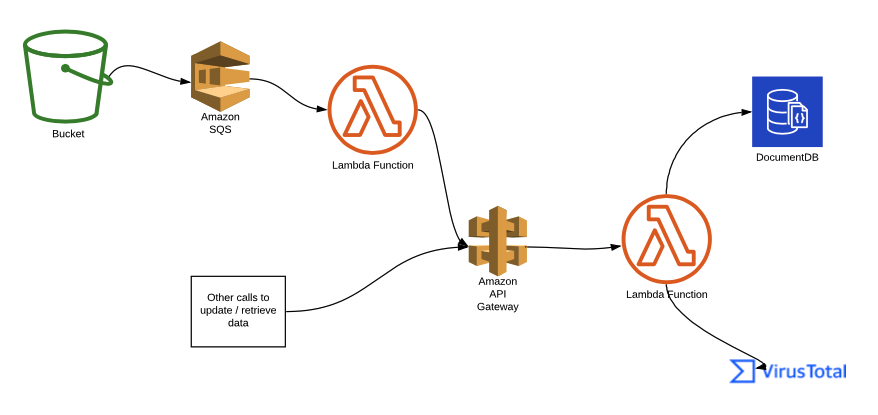

# Elementor - Data Engineer Home Assignment

## Coding Assignment

### High-level Design

1. CSV files with URLs for inspection are updated in a designated location in S3.
2. This location is configured to trigger an event with every update of a file, adding the file location to an SQS queue.
3. A lambda listens to the queue and is triggered with every event.
4. The lambda calls an API that uses another lambda to call the VirusTotal API and update analysis data in a documentDB.
4. This API can be called from other resources to update specific URLs and retrieve the analysis data from the database.


### Detailed Design
#### Code flow
1. Load csv from S3
2. For every URL(row) in file, check state in DB. If data was refreshed in last 30 minutes, only update a 'last update request' timestamp.
3. For un-fresh URLs, call VirusTotal API and update DB with results according to business logic.

#### Code project structure
* lambda handler - the entry point and where the flow is handled
* database module - to check state, update, and retrieve data
* virus_total module - for calling the API

#### Data structure
Assuming that the data gathered by this solution is used mostly in the single URL level and not for aggregated analysis, a document database is used.
Each document represents a URL and has the following structure:
```json
{
"id": "varchar",
"last_update_request": "timestamp",
"last_update": "timestamp",
"site_risk": "string",
"voting": [{"key": "value"}],
"categories": [{"key": "value"}] 
}
```
TODO: 
- [ ] Actually build the solution


## SQL Questions
Answers in sql_questions folder